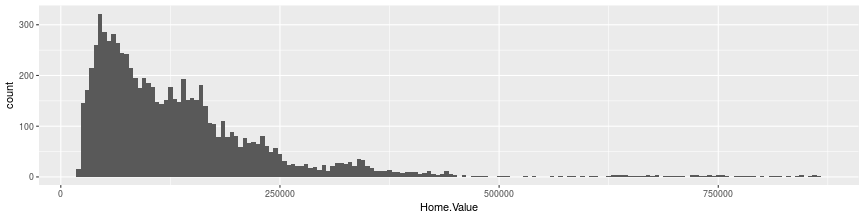

Tidy data tutorial - Day 2
========================================================
author: Keith H. Turner (Twitter: @kay_aych)
date: Friday, May 12, 2017
css: tutorial.css

Outline for the next few days
========================================================
* Day 1: Tidy data
  + Importing your data into R
  + Tidying your data
  + Transforming your tidy data
* Day 2: `ggplot` and modeling
  + Visualizing your tidy data
  + Incorporating basic modeling into your tidy workflow

These tutorials are largely based on the book *R for Data Science*, which is also available for free online at [`https://r4ds.had.co.nz`](https://r4ds.had.co.nz)

Outline
========================================================
* Day 2: `ggplot` and modeling
  + **Visualizing your tidy data**
  + Incorporating basic modeling into your tidy workflow

Much of today is based on  based on the [ggplot tutorial](http://tutorials.iq.harvard.edu/R/Rgraphics/Rgraphics.html) at the Harvard University Institute for Quantitative Social Science

ggplot2
========================================================
* Great [cheat sheet](https://www.rstudio.com/wp-content/uploads/2015/03/ggplot2-cheatsheet.pdf) from Rstudio 
* The "grammar of graphics" - construct a plot from constituent parts
  + data (`data = mtcars`)
  + aesthetic mapping (`aes()`)
  + geometric object (`geom_*()`)
  + statistical transformations (`stat_*()`)
  + scales (`scale_*()`)
  + faceting (`facet_*()`)
  + And others!
* Additive syntax: `ggplot(data, aes()) + geom_point() + coord_equal() + scale_x_log10() + theme_bw()`

ggplot2 vs. base R graphics
========================================================
class: small-code
* Base R graphics are easy for simple graphs
  + You just have to know the plotting function you want

```r
# Run this code!
library(tidyverse)
housing <- read_csv("data/landdata-states.csv")
housing
```

```
# A tibble: 7,803 × 11
   State region    Date Home.Value Structure.Cost Land.Value
   <chr>  <chr>   <dbl>      <int>          <int>      <int>
1     AK   West 2010.25     224952         160599      64352
2     AK   West 2010.50     225511         160252      65259
3     AK   West 2009.75     225820         163791      62029
4     AK   West 2010.00     224994         161787      63207
5     AK   West 2008.00     234590         155400      79190
6     AK   West 2008.25     233714         157458      76256
7     AK   West 2008.50     232999         160092      72906
8     AK   West 2008.75     232164         162704      69460
9     AK   West 2009.00     231039         164739      66299
10    AK   West 2009.25     229395         165424      63971
# ... with 7,793 more rows, and 5 more variables: Land.Share..Pct. <dbl>,
#   Home.Price.Index <dbl>, Land.Price.Index <dbl>, Year <int>, Qrtr <int>
```

ggplot2 vs. base R graphics
========================================================
class: small-code
* Base R graphics are easy for simple graphs
  + You just have to know the plotting function you want

```r
hist(housing$Home.Value)
```


ggplot2 vs. base R graphics
========================================================
class: small-code
* ggplot can be cumbersome for simple graphs

```r
ggplot(housing, aes(x = Home.Value)) + geom_histogram()
```


ggplot2 vs. base R graphics
========================================================
class: small-code
* Base R can get very messy very quickly when you are mapping multiple data series onto a plot

```r
plot(Home.Value ~ Date, data=subset(housing, State == "MA"))
points(Home.Value ~ Date, col="red", data=subset(housing, State == "TX"))
legend(1975, 400000,
       c("MA", "TX"), title="State",
       col=c("black", "red"),
       pch=c(1, 1))
```


ggplot2 vs. base R graphics
========================================================
class: small-code
* ggplot2 is easy and powerful for more complex graphs

```r
housing %>%
  filter(State %in% c("MA", "TX")) %>%
  ggplot(aes(Date, Home.Value, color = State)) +
  geom_point()
```


The grammar of graphics
========================================================
* Helpful to think through visualization in this order
  + data (`data = mtcars`)
  + **aesthetic mapping (`aes()`)**
  + **geometric object (`geom_*()`)**
  + statistical transformations (`stat_*()`)
  + scales (`scale_*()`)
  + coordinate system (`coord_*()`)
  + faceting (`facet_*()`)
  + themes (`theme_*()`)

Aesthetic mapping
========================================================
class: small-code
* Map a variable (a column in our tidy data) to a property of a plot

```r
aes(Year, Num_Cases, # x and y are default 1st and 2nd, all others must be named
    color = Patient_Sex, # "outside" color of point, bar, shape, etc.
    fill = Disease_Name, # "inside" color
    alpha = Seriousness, # transparency
    shape = Age_Group, # for points
    size = Population_Share
    # And MANY more, x/y min/max (for polygons), linetype (for lines), etc.
    )
```

```
* x      -> Year
* y      -> Num_Cases
* colour -> Patient_Sex
* fill   -> Disease_Name
* alpha  -> Seriousness
* shape  -> Age_Group
* size   -> Population_Share
```
* Different geoms only accept certain aesthetics (makes sense, why would a point have a `fontface`?)
  + Irrelevant aesthetics ignored for a certain geoms

Geometric objects
========================================================
class: small-code
* Display aesthetics with a geom

```r
## One variable
geom_histogram()

## Two variables
# Continuous X, continuous Y
geom_point()
geom_smooth()

# Discrete X, continuous Y
geom_boxplot()
geom_violin()

# Continuous bivariate distribution
geom_bin2d()
```

Geometric objects
========================================================


From the Rstudio [ggplot2 cheat sheet](https://www.rstudio.com/wp-content/uploads/2015/03/ggplot2-cheatsheet.pdf)

Geoms and aesthetics
========================================================
class: small-code
* A geom has an associated aesthetic
  + Inherited from `ggplot(aes())` if not specified


```r
ggplot(housing, aes(Date, Home.Value)) +
  geom_point(aes(color = region))
```


Geom_point
========================================================
class: small-code
* Required aesthetic mappings: `x`, `y`
  + Optional mappings: `color`, `fill`, `alpha`, `size`, `shape`


```r
housing %>% filter(Year == 2008) %>%
  # Variables can be transformed in aes() calls
  ggplot(aes(log10(Land.Value), Structure.Cost, color = Qrtr)) + geom_point()
```


Geom_text
========================================================
class: small-code
* Required aesthetic mappings: `x`, `y`, `label`
  + Optional mappings: `color`, `alpha`, `size`, `fontface`, ...


```r
housing %>% filter(Year == 2008) %>%
  # Variables can be transformed in aes() calls
  ggplot(aes(log10(Land.Value), Structure.Cost, color = Qrtr, label = State)) + geom_text()
```


More than one geom
========================================================
class: small-code
* You can add more than one `geom` to a plot


```r
housing %>% filter(Year == 2008, Qrtr == 1) %>%
  ggplot(aes(log10(Land.Value), Structure.Cost)) +
  geom_point() +
  geom_smooth()
```


More than one geom
========================================================
class: small-code
* Remember about aesthetic mappings inheriting


```r
housing %>% filter(Year == 2008, Qrtr == 1) %>%
  ggplot(aes(log10(Land.Value), Structure.Cost, color = region)) +
  geom_point() +
  geom_smooth()
```


More than one geom
========================================================
class: small-code
* Remember about aesthetic mappings inheriting


```r
housing %>% filter(Year == 2008, Qrtr == 1) %>%
  ggplot(aes(log10(Land.Value), Structure.Cost)) +
  geom_point(aes(color = region)) +
  geom_smooth()
```


Aesthetic mapping vs. assignment
========================================================
class: small-code
* Inside `aes()`: map variable to aesthetics
* Outside `aes()`: fixed aesthetics


```r
housing %>% filter(Year == 2008, Qrtr == 1) %>%
  ggplot(aes(log10(Land.Value), Structure.Cost)) +
  geom_point(aes(size = 2), color = "red")
```


Graphical exercise 1
========================================================
class: small-code
* Generate this plot for the `Midwest` region


<iframe src="https://giphy.com/embed/l0HlBO7eyXzSZkJri" width="240" height="175" frameBorder="0" class="giphy-embed" allowFullScreen></iframe>

Graphical exercise 1
========================================================
class: small-code


```r
housing %>%
  filter(region == "Midwest") %>%
  ggplot(aes(Date, Home.Price.Index)) +
  geom_point(aes(color = State)) +
  geom_smooth()
```


The grammar of graphics
========================================================
* Helpful to think through visualization in this order
  + data (`data = mtcars`)
  + aesthetic mapping (`aes()`)
  + geometric object (`geom_*()`)
  + **statistical transformations (`stat_*()`)**
  + scales (`scale_*()`)
  + coordinate system (`coord_*()`)
  + faceting (`facet_*()`)
  + themes (`theme_*()`)

Statistical transformations
========================================================
class: small-code

* Some geoms don't require transformations (e.g. scatterplots: x = x, y = y)
* However, some geoms such as `geom_boxplot`, `geom_histogram`, `geom_smooth`, etc., require transformations
  * IQR, prediction, etc.
* These geoms have *default* statistical transformations and parameters, but they can be changed
  * Look at the documentation for each geom to discover the default stat (e.g. `stat_bin`, `stat_count`, etc.)

Statistical transformations
========================================================
class: small-code

* Arguments in `geom`s are passed to the default `stat`

```r
ggplot(housing, aes(Home.Value)) + geom_histogram()
```


```r
ggplot(housing, aes(Home.Value)) + geom_histogram(binwidth = 5000)
```



Changing the default statistical transformation
========================================================
class: small-code

* **Very** common occurrence for bar graphs with a y value


```r
housing %>%
  group_by(Year, region) %>%
  summarize(mean_hpi = mean(Home.Price.Index)) %>%
  ggplot(aes(Year, mean_hpi, fill = region)) +
  geom_bar()
```

```
Error: stat_count() must not be used with a y aesthetic.
```


Changing the default statistical transformation
========================================================
class: small-code

* The default stat for `geom_bar` is `stat_count`
  * We don't want that! We want to show the `y` value itself
  

```r
housing %>%
  group_by(Year, region) %>%
  summarize(mean_hpi = mean(Home.Price.Index)) %>%
  ggplot(aes(Year, mean_hpi, fill = region)) +
  geom_bar(stat = "identity", position = "dodge")
```


Statistical transformation exercise
========================================================
class: small-code

* Plot a **line fit** with `geom_smooth` onto `Structure.Cost`, one for each `region`


<iframe src="https://giphy.com/embed/ZXKZWB13D6gFO" width="240" height="145" frameBorder="0" class="giphy-embed" allowFullScreen></iframe>

Statistical transformation exercise
========================================================
class: small-code

* Plot a **line fit** with `geom_smooth` onto `Structure.Cost`, one for each `region`


```r
housing %>%
  ggplot(aes(Date, Structure.Cost, color = region)) +
  geom_smooth(method = "lm")
```


The grammar of graphics
========================================================
* Helpful to think through visualization in this order
  + data (`data = mtcars`)
  + aesthetic mapping (`aes()`)
  + geometric object (`geom_*()`)
  + statistical transformations (`stat_*()`)
  + **scales (`scale_*()`)**
  + coordinate system (`coord_*()`)
  + faceting (`facet_*()`)
  + themes (`theme_*()`)

Scales: controlling aesthetic mapping
========================================================
* An aesthetic mapping only maps a variable to an aesthetic. It doesn't say anything about **how** that should be done
  + Log scale on x or y axis?
  + Specify colors / fills / size ranges?
* Scale function names follow the form `scale_<aesthetic>_<type>`
  + `scale_x_log10()`
  + `scale_color_discrete()`
  + `scale_alpha_manual()`
  + `scale_fill_brewer()` - [Color Brewer](http://colorbrewer2.org/#type=sequential&scheme=BuGn&n=3) palettes

Scales: controlling aesthetic mapping
========================================================
* Scale specifications typically have the following arguments
  + `name`
  + `limits`
  + `breaks` - Where should the ticks appear
  + `labels` - The labels that appear at each break

Scale modification example
========================================================
class: small-code

* We'll start by defining a plot and storing it in the variable `p`
  + Useful for quickly trying a bunch of different things


```r
p <- housing %>%
  ggplot(aes(State, Home.Price.Index, color = Date)) +
  geom_point(alpha = 0.5, position = position_jitter(width = 0.25, height = 0)) +
  theme(legend.position = "top")
p
```


Scale modification example
========================================================
class: small-code

* Change the x axis label


```r
p <- p + scale_x_discrete("State Abbreviation") # or xlab("xyz") to just change name
p
```


Scale modification example
========================================================
class: small-code

* Change the color scale breaks, labels, and range


```r
p + scale_color_continuous("",
                           breaks = c(1976, 1992, 2008),
                           labels = c("'76", "'92", "'08"),
                           low = "blue", high = "red")
```


Scale modification example
========================================================
class: small-code

* Use ColorBrewer scale (run `RColorBrewer::display.brewer.all()` to see palettes)


```r
p + scale_color_distiller("", # _distiller for continuous, _brewer for discrete
                          palette = "Spectral",
                          breaks = c(1976, 1992, 2008),
                          labels = c("'76", "'92", "'08"))
```


The grammar of graphics
========================================================
* Helpful to think through visualization in this order
  + data (`data = mtcars`)
  + aesthetic mapping (`aes()`)
  + geometric object (`geom_*()`)
  + statistical transformations (`stat_*()`)
  + scales (`scale_*()`)
  + coordinate system (`coord_*()`)
  + **faceting (`facet_*()`)**
  + themes (`theme_*()`)

Facets - separate graphs for subsets of data
========================================================
class: small-code

* `facet_wrap()`: wraparound series of plots on one (or more) variables
  + Specify facetting variables as formula


```r
ggplot(housing, aes(Date, Home.Price.Index)) +
  geom_line() +
  facet_wrap(~State)
```


Facets - separate graphs for subsets of data
========================================================
class: small-code

* `facet_wrap()`: wraparound series of plots on one (or more) variables
  + You can facet on more than one variable (first varies slowest)
  

```r
ggplot(housing, aes(Date, Home.Price.Index)) +
  geom_line() +
  facet_wrap(~region + State)
```


Facets - separate graphs for subsets of data
========================================================
class: small-code

* `facet_grid()`: 2d grid of plots for two (or more) variables
  + `labeller` argument for more info on facet labels


```r
ggplot(mtcars, aes(wt, mpg)) +
  geom_point() +
  facet_grid(am~cyl, labeller = "label_both")
```


Facets - separate graphs for subsets of data
========================================================
class: small-code

* `facet_grid()`: 2d grid of plots for two (or more) variables
  + `scales` argument for free/fixed scale limits


```r
ggplot(mtcars, aes(wt, mpg)) +
  geom_point() +
  facet_grid(am~cyl, labeller = "label_both", scales = "free_x")
```


The grammar of graphics
========================================================
* Helpful to think through visualization in this order
  + data (`data = mtcars`)
  + aesthetic mapping (`aes()`)
  + geometric object (`geom_*()`)
  + statistical transformations (`stat_*()`)
  + scales (`scale_*()`)
  + coordinate system (`coord_*()`)
  + faceting (`facet_*()`)
  + **themes (`theme_*()`)**

Themes - finishing touches
========================================================
class: small-code

* Handles non-data elements such as axis labels, plot backgrounds, fonts, legends, etc.
  + Syntax can be a bit ugly here, your best bet is to google when you need to know something like "how do I rotate x axis labels 45 degrees"
  + Some built-in themes


```r
theme_bw()
theme_classic()
theme_dark()
```


```r
ggplot(mtcars, aes(wt, mpg, color = factor(cyl))) +
  geom_point() +
  theme_minimal()
```


tidyverse visualization challenge 1
========================================================
class: small-code

* Recreate this graph of UFO sightings using `tidyverse`
  + Tip: Start by filtering and cleaning data, then build plot
  + Tip: `region` can be found in `housing`


```r
nuforc <- read_csv("data/nuforc_events.csv")
```


tidyverse visualization challenge 1
========================================================
class: small-code


```r
# Get regions from housing data (should drop Canada b/c of inner_join)
housing %>% select(State, region) %>% unique %>% inner_join(nuforc) %>%
  filter(!is.na(Year), !is.na(Shape), !is.na(region), Year > 1938) %>% # Clean
  # Collapse rare shapes
  group_by(Shape) %>% mutate(Shape_Disp = ifelse(n() > 5000, Shape, "Other")) %>%
  group_by(Year, Shape_Disp, region) %>% tally %>% # tally = summarize(n = n())
  ggplot(aes(Year, n, color = Shape_Disp)) +
  geom_smooth(se = F) +
  scale_color_brewer("UFO Shape", palette = "Set1") +
  facet_wrap(~region, scales = "free_y") +
  theme_minimal() +
  ylab("Number of sightings")
```


tidyverse visualization challenge 2
========================================================
class: small-code

* How much do the former USSR countries vote for each other vs. other countries in the finals?
  + Post your graph + code in `#gds_eurovision_ussr` on Slack!


```r
library(readxl)
former_ssrs <- c("Armenia", "Azerbaijan", "Belarus", "Estonia", "Georgia",
                "Latvia", "Lithuania", "Moldova", "Poland", "Russia", "Ukraine")
eurovision_finals_ussr <-
  read_excel("data/eurovision_song_contest_1975_2016.xlsx") %>%
  filter(competition_round == "f", from_country != to_country) %>%
  mutate(from_affiliation = ifelse(from_country %in% former_ssrs, "USSR", "Other"),
         to_affiliation = ifelse(to_country %in% former_ssrs, "USSR", "Other"))
```

Eurovision USSR voting bloc viz 1
========================================================
class: small-code


```r
eurovision_finals_ussr %>%
  mutate(to_affiliation = factor(to_affiliation, levels = c("USSR", "Other"))) %>% # Change the order so USSR is red (of course!)
  ggplot(aes(year, points, color = to_affiliation)) +
  geom_vline(xintercept = 1993.5) +
  geom_jitter(alpha = 0.2, width = 0) +
  geom_smooth() +
  facet_wrap(~from_affiliation, labeller = "label_both") +
  scale_color_brewer(palette = "Set1") +
  theme_bw()
```


Eurovision USSR voting bloc viz 2
========================================================
class: small-code


```r
eurovision_finals_ussr %>%
  filter(from_affiliation == "USSR") %>%
  ggplot(aes(year, points, color = to_affiliation)) +
  geom_jitter(alpha = 0.5) +
  geom_smooth() +
  scale_color_brewer(palette = "Dark2") +
  facet_wrap(~from_country, labeller = "label_both") +
  theme_bw()
```


Outline
========================================================
* Day 2: `ggplot` and modeling
  + Visualizing your tidy data
  + **Incorporating basic modeling into your tidy workflow**

Modeling
========================================================
* Probably won't have time to get to this, so I'll just point you to a few resources and show an example or two here
  + [`modelr`](https://github.com/tidyverse/modelr) - some nice functions like `add_residuals(model, df)`
  + [`broom`](https://cran.r-project.org/web/packages/broom/vignettes/broom.html) - extract key metrics from a model: `tidy` for coefficients, `glance` for a one-row summary with r^2, AIC, etc.
  + [`purrr`](https://purrr.tidyverse.org) - map function calls onto list-columns in tibbles (example later)
  + The [R for Data Science chapter on modeling](http://r4ds.had.co.nz/model-intro.html)

Modeling in a tidy framework
========================================================
class: small-code

* Clearest use case is testing multiple models and/or multiple subsets of your data
  + Anything else you can just run it like a normal model


```r
library(randomForest)
rf <- randomForest(mpg ~ ., data = mtcars)
rf
```

```

Call:
 randomForest(formula = mpg ~ ., data = mtcars) 
               Type of random forest: regression
                     Number of trees: 500
No. of variables tried at each split: 3

          Mean of squared residuals: 5.547114
                    % Var explained: 84.24
```

Modeling in a tidy framework
========================================================
class: small-code

* Store sub-data frames as entries in a list-column with `tidyr::nest`
  + Can run on a grouped tibble, or by specifying the columns you want to nest with `dplyr` syntax


```r
mtcars %>% group_by(cyl) %>% nest
```

```
# A tibble: 3 × 2
    cyl               data
  <dbl>             <list>
1     6  <tibble [7 × 10]>
2     4 <tibble [11 × 10]>
3     8 <tibble [14 × 10]>
```

```r
mtcars %>% nest(-cyl)
```

```
# A tibble: 3 × 2
    cyl               data
  <dbl>             <list>
1     6  <tibble [7 × 10]>
2     4 <tibble [11 × 10]>
3     8 <tibble [14 × 10]>
```

Modeling in a tidy framework
========================================================
class: small-code

* Apply function call with `purrr::map`


```r
mtcars %>% nest(-cyl) %>%
  mutate(mpg_rf = map(data, function(d) randomForest(mpg ~ ., data = d)))
```

```
# A tibble: 3 × 3
    cyl               data                     mpg_rf
  <dbl>             <list>                     <list>
1     6  <tibble [7 × 10]> <S3: randomForest.formula>
2     4 <tibble [11 × 10]> <S3: randomForest.formula>
3     8 <tibble [14 × 10]> <S3: randomForest.formula>
```

Modeling in a tidy framework
========================================================
class: small-code

* Keep going! Add predictions from the model to the sub-tibbles


```r
library(modelr)
mtcars %>% nest(-cyl) %>%
  mutate(mpg_rf = map(data, function(d) randomForest(mpg ~ ., data = d)),
         mpg_preds = map2(data, mpg_rf, add_predictions)) # map2 is for 2 arg functions
```

```
# A tibble: 3 × 4
    cyl               data                     mpg_rf          mpg_preds
  <dbl>             <list>                     <list>             <list>
1     6  <tibble [7 × 10]> <S3: randomForest.formula>  <tibble [7 × 11]>
2     4 <tibble [11 × 10]> <S3: randomForest.formula> <tibble [11 × 11]>
3     8 <tibble [14 × 10]> <S3: randomForest.formula> <tibble [14 × 11]>
```

Modeling in a tidy framework
========================================================
class: small-code

* Back out from nested columns with...wait for it...`unnest`


```r
mtcars %>% nest(-cyl) %>%
  mutate(mpg_rf = map(data, function(d) randomForest(mpg ~ ., data = d)),
         mpg_preds = map2(data, mpg_rf, add_predictions)) %>%
  unnest(mpg_preds)
```

```
# A tibble: 32 × 12
     cyl   mpg  disp    hp  drat    wt  qsec    vs    am  gear  carb
   <dbl> <dbl> <dbl> <dbl> <dbl> <dbl> <dbl> <dbl> <dbl> <dbl> <dbl>
1      6  21.0 160.0   110  3.90 2.620 16.46     0     1     4     4
2      6  21.0 160.0   110  3.90 2.875 17.02     0     1     4     4
3      6  21.4 258.0   110  3.08 3.215 19.44     1     0     3     1
4      6  18.1 225.0   105  2.76 3.460 20.22     1     0     3     1
5      6  19.2 167.6   123  3.92 3.440 18.30     1     0     4     4
6      6  17.8 167.6   123  3.92 3.440 18.90     1     0     4     4
7      6  19.7 145.0   175  3.62 2.770 15.50     0     1     5     6
8      4  22.8 108.0    93  3.85 2.320 18.61     1     1     4     1
9      4  24.4 146.7    62  3.69 3.190 20.00     1     0     4     2
10     4  22.8 140.8    95  3.92 3.150 22.90     1     0     4     2
# ... with 22 more rows, and 1 more variables: pred <dbl>
```

Modeling in a tidy framework
========================================================
class: small-code

* Put it all together


```r
mtcars %>% nest(-cyl) %>%
  mutate(mpg_rf = map(data, function(d) randomForest(mpg ~ ., data = d)),
         mpg_preds = map2(data, mpg_rf, add_predictions)) %>%
  unnest(mpg_preds) %>%
  ggplot(aes(mpg, pred, color = wt)) +
  geom_abline() +
  geom_point() +
  scale_color_distiller(palette = "Spectral") +
  facet_wrap(~cyl, scales = "free") +
  theme_dark()
```


Modeling in a tidy framework
========================================================
class: small-code

* One more - many models - ask me if you have any questions!


```r
models_to_try <- list(function(d) lm(mpg ~ wt + disp, data = d),
                      function(d) lm(mpg ~ wt + disp + hp, data = d),
                      function(d) lm(mpg ~ wt * disp * hp, data = d))
lapply(models_to_try, function(modf) {
  mtcars %>% nest(-cyl) %>%
    mutate(mod = map(data, modf), gl = map(mod, broom::glance),
           f = map_chr(mod, function(m) as.character(formula(m))[c(2,1,3)] %>%
                         paste(collapse = " "))) %>%
    unnest(gl) }) %>% bind_rows %>%
  ggplot(aes(f, BIC, fill = f)) + geom_bar(stat = "identity") +
  scale_x_discrete("", breaks = NULL) +
  scale_fill_brewer("lm formula", palette = "Dark2") +
  facet_wrap(~cyl, labeller = "label_both") + theme_bw()
```


Thank you!!
=======================================================

* Resources
  + [R for Data Science](https://r4ds.had.co.nz)
  + [Tidyverse homepage](http://tidyverse.org/) - lots of good vignettes / documentation here
  + [RStudio cheat sheets](https://www.rstudio.com/resources/cheatsheets/): [`dplyr`](https://github.com/rstudio/cheatsheets/raw/master/source/pdfs/data-transformation-cheatsheet.pdf), [`readr`](https://github.com/rstudio/cheatsheets/raw/master/source/pdfs/data-import-cheatsheet.pdf), [`ggplot2`](https://www.rstudio.com/wp-content/uploads/2016/11/ggplot2-cheatsheet-2.1.pdf)
  + Vignettes: [Intro to `dplyr`](https://cran.rstudio.com/web/packages/dplyr/vignettes/introduction.html), [`dplyr` databases](https://cran.r-project.org/web/packages/dplyr/vignettes/databases.html), [`broom`](https://cran.r-project.org/web/packages/broom/vignettes/broom.html)
  + Slack #r-lang, #domino
  + [Domino support](mailto:support@dominodatalab.com)
  + The tidyverse community
  + Your coworkers, incl. me!
